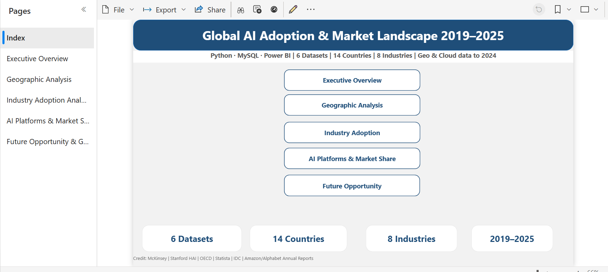
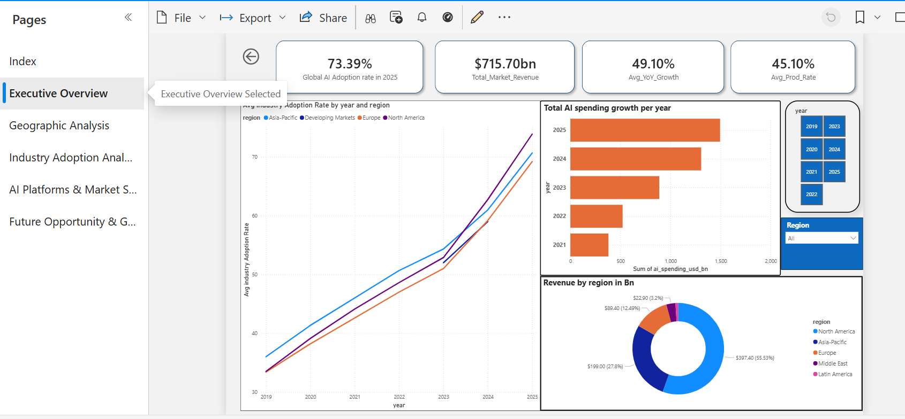
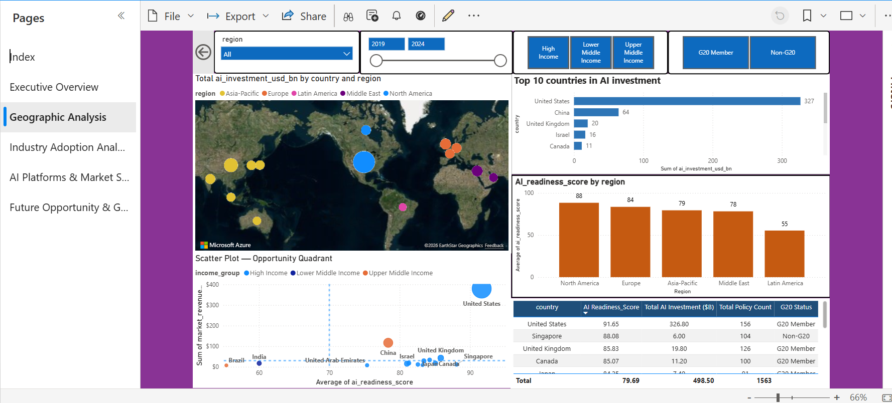
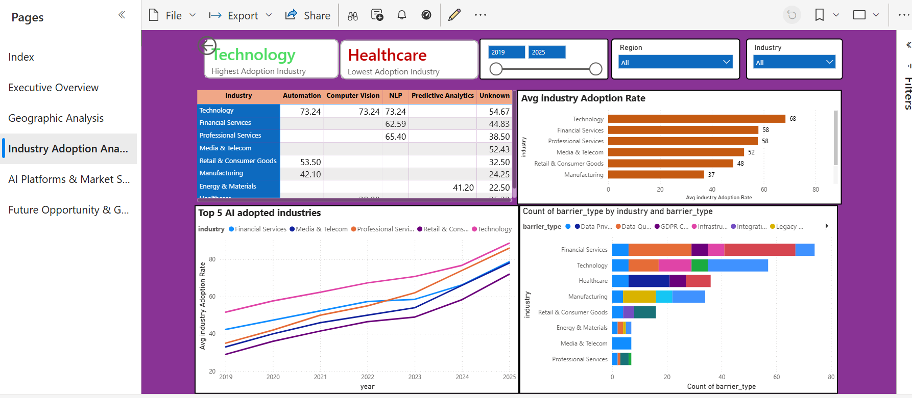
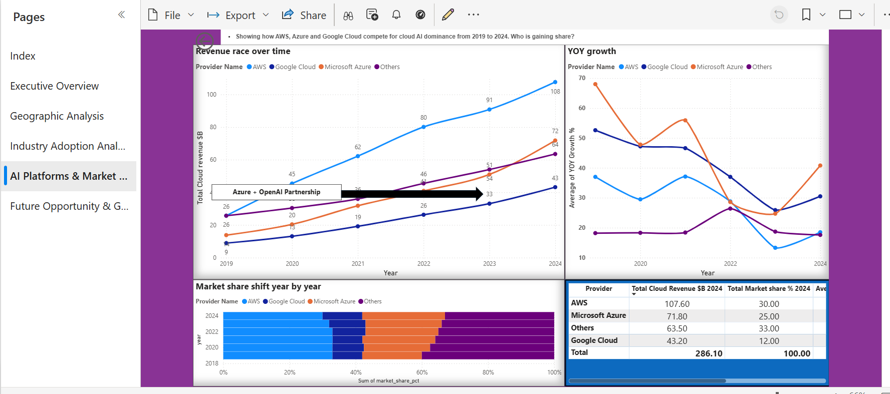
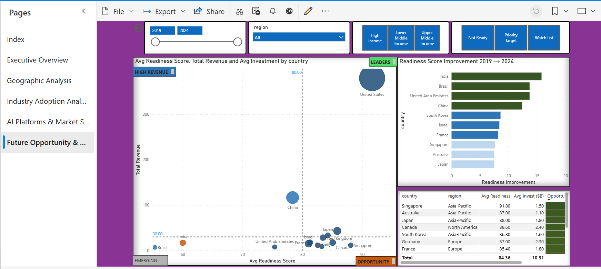

# Global AI Adoption & Market Landscape (2019–2025)

**Python · MySQL · Power BI** &nbsp;|&nbsp; 6 Datasets · 14 Countries · 8 Industries · 517 Rows

---

## Overview

An end-to-end data analytics project tracking how AI has evolved globally across industries, geographies, and cloud platforms from 2019 to 2025.

Built a complete pipeline — raw data ingestion, cleaning, EDA, SQL storage, and a 5-page interactive Power BI dashboard — to answer three business questions:

- Which industries and regions lead AI adoption, and which lag?
- Where does high AI readiness meet low market revenue (opportunity gap)?
- How are AWS, Azure and Google Cloud competing for dominance?

---

Project Architecture

Raw Data Sources
    ↓
Python Data Cleaning (pandas)
    ↓
Merged Analytical Tables
    ↓
MySQL Database
    ↓
SQL Analytical Queries
    ↓
Power BI Dashboard
    ↓
Project_documentation

## Tools & Skills


---


| | |
|---|---|
| **Python** | pandas, SQLAlchemy — data cleaning, EDA, multi-source merging, MySQL upload |
| **MySQL** | Window functions, CAGR calculations, CASE WHEN tiers, aggregation queries |
| **Power BI** | DAX measures, matrix heatmap, scatter quadrant, forecast line, interactive slicers |

---

## Data Sources

6 industry datasets merged into 3 analytical tables:

| Source | What It Covers |
|---|---|
| McKinsey State of AI | Industry adoption rates by region (2019–2025) |
| Stanford HAI Index | Country-level AI investment, patents, research |
| OECD AI Observatory | Policy count, readiness scores, talent scores |
| Statista | Market revenue and CAGR by country |
| IDC | Enterprise spending, use cases, scaling barriers |
| Amazon / Alphabet Annual Reports | AWS, Azure, GCP cloud revenue and market share |

---

## Dashboard — 5 Pages

### Index


---

### Page 1 — Executive Overview


Global AI adoption rose from **33.9% → 73.4%** between 2019 and 2025. Total market revenue reached **$715.7B**. Only 45% of AI pilots reach production — a scaling gap visible across all industries.

---

### Page 2 — Geographic Analysis


USA leads with **$326.8B** in total investment — 5× China. North America holds **55.5%** of global AI revenue. India improved AI readiness faster than any country: **+15.8 points** in 5 years.

---

### Page 3 — Industry Adoption Analysis


**Technology** leads at 68% average adoption. **Healthcare** lags at 35% — Regulatory Compliance is its dominant barrier. Talent Gap is the #1 scaling barrier across all 8 industries.

---

### Page 4 — AI Platforms & Market Share


AWS leads in revenue ($107.6B) but losing market share (33% → 30%). **Azure growing fastest** at 44.3% avg YoY — Microsoft's OpenAI investment visible as a direct inflection point in 2023 data.

---

### Page 5 — Future Opportunity & Gap Analysis


7 countries — Singapore, Australia, Japan, Canada, South Korea, Germany, France — show AI readiness above 80 but underperforming market revenue. Projected 2025 global revenue: **$401B** (52.2% CAGR basis).

---

## Key Findings

- AI adoption **doubled globally** in 6 years — every region accelerated post-2021
- **USA dominates investment** but India and Brazil are closing the readiness gap faster than raw numbers suggest
- **Azure is the cloud growth story** — fastest-growing provider, OpenAI partnership directly reflected in data
- **Healthcare is the biggest scaling laggard** — regulatory compliance, not talent or data, is the primary barrier
- **7 high-readiness countries are under-monetised** — the clearest vendor opportunity signal in the dataset

---

## How to Run

```bash
# Install dependencies
pip install pandas sqlalchemy mysql-connector-python

# Set your MySQL password and CSV folder path in the script (2 lines)
# Then run:
python AI_Adoption_Analysis.py
```

This auto-creates the database, cleans all data, runs EDA, and uploads 3 tables to MySQL.

Open MySQL Workbench → run queries from `AI_adoption_Analysis_sql_queries.txt`

Load 3 clean CSVs from `data/clean/` into Power BI.

---

## Files

## Repository Structure

```
Global-AI-Adoption-Market-Landscape-2019-2025
│
├── Raw data from all sources
│   └── Raw AI Adoption Datasets All6.zip
│       # 6 original source CSV datasets
│
├── Python code
│   └── AI Adoption Analysis code.py
│       # Full Python pipeline: data cleaning, EDA, merging, MySQL upload
│
├── Cleaned files (Python Output)
│   ├── ai_cloud.csv
│   ├── ai_geo.csv
│   └── ai_industry.csv
│       # 3 merged analytical tables generated by Python
│
├── SQL Queries
│   └── All sql queries with questions and expected answers.sql
│       # 20 analytical queries using MySQL
│
├── Power BI Dashboard
│   └── AI-Adoption-Dashboard.pbix
│       # 6-page interactive dashboard
│
└── Dashboard Snaps
    └── Dashboard screenshots
        # Images used in README preview
```

---

*Data: McKinsey · Stanford HAI · OECD · Statista · IDC · Amazon / Alphabet Annual Reports · till 2025*
